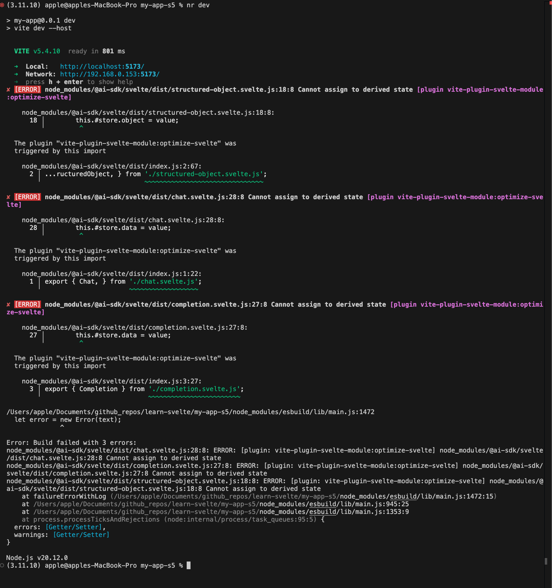

# Learn Svelte (v5)

_Note: On, 11 June 2025 - I moved notes from separte `Readme.svletekit.md` file and `Readme.md` (of my svelte 4 project) to this file for easy reference of sources and easy organizing of learning material._

**Quick links:**

- ❤️Deployment info
  - **[https://sveltev5.vercel.app](https://sveltev5.vercel.app)**
  - _(The deployment is done using Vercel with `SvelteKit (v1)` preset)_
- **Todo:** Testing in Svelte: [Click here](https://svelte.dev/docs/svelte/testing)
- `svelte` on npm - [Click here](https://www.npmjs.com/package/svelte)
- Article on Svelte 5 on frontend masters: [Click here](https://frontendmasters.com/blog/introducing-svelte-5/)
- **Todo:** Introducing runes: [Click here](https://svelte.dev/blog/runes) (20 Sep, 2023)
- Popular Svelte Question on Stackoverflow (src):
  - How can I pass parameters to on:click in Svelte?: [Click here](https://stackoverflow.com/a/61025286)
- Tutorial by FireshipIo: [Click here](https://www.youtube.com/watch?v=043h4ugAj4c)
  - Learn svelte by fireshipio: [Click here](https://youtu.be/043h4ugAj4c)
- **Article - COMPANIES USING SVELTE:** [Click here](https://www.okupter.com/blog/companies-using-svelte) (#apps made with svelte, #created with svetle, #made using svelte)
  - (Done) - Why Stack Overflow is embracing Svelte: [Click here](https://the-stack-overflow-podcast.simplecast.com/episodes/why-stack-overflow-is-embracing-svelte/transcript) (Or check my annotated pdf - [click here](./Why_Stack_Overflow_is_embracing_Svelte.pdf))
  - Apps made with svelte in "this week in svelte" blog - [Click here](https://svelte.dev/blog/whats-new-in-svelte-september-2024#Community-Showcase-Apps-Sites-built-with-Svelte)
- Svelte Extension: https://marketplace.visualstudio.com/items?itemName=svelte.svelte-vscode
- **2024's New article on Svelte on Linkedin: [Click here](https://www.linkedin.com/pulse/from-react-svelte-frontend-future-work-damon-vestervand-3hjsf/)**
- Article - Vercel welcomes [Rich Harris - Reddit](https://www.reddit.com/r/nextjs/comments/qrpzaw/vercel_welcomes_rich_harris_creator_of_svelte/).
- TO READ (Blog date: 6 Dec 2021): [https://thenewstack.io/vercel-and-svelte-a-perfect-match-for-web-developers/](https://thenewstack.io/vercel-and-svelte-a-perfect-match-for-web-developers/)
- threlte: https://threlte.xyz/
- **Awesome talk by Rich Harris**: [Click here](https://youtu.be/AdNJ3fydeao)

## +ves and -ves of svelte

- **+ves of Svelte:**
  - Linkedin Post: [Click here](https://www.linkedin.com/pulse/from-react-svelte-frontend-future-work-damon-vestervand-3hjsf/)
  - **HackMd - SvelteJS: My ecosystem is bigger than yours: [Click here](https://hackmd.io/@roguegpu) ([Article reading by Primegan](https://www.youtube.com/watch?v=bh-e700IlmQ))**
  - Svelte is more popular than Solidjs - The Difference you didn’t know existed between Solid.js and Svelte: [Click here](https://medium.com/@shariq.ahmed525/the-difference-you-didnt-know-existed-between-solid-js-and-svelte-7ad6591abc10)
  - Works with Capacitor
  - Has good testing support: [Click here](https://svelte.dev/docs/faq#how-do-i-test-svelte-apps)
- **-ves:**
  - ~~No comments allowed inside jsx or html. [Check this issue](https://github.com/sveltejs/rfcs/pull/43)~~
  - ❤️ [Check this comment](https://github.com/sveltejs/rfcs/pull/43#issuecomment-798933140) for an alternate answer I follow.
    - TLDR: Use `{...{/* comment */}}` which works because {...{}} is valid to pass.
  - Google Search: Why svelte is not popular: [Click here](https://www.google.com/search?q=why+svelte+is+not+popular)
  - _TODO: Nov 16, 2020_ - Why people aren’t switching to Svelte yet: [Click here](https://blog.logrocket.com/why-people-arent-switching-to-svelte-yet/)

## Svelte in Embedded web


## Learn: On upgrading all deps of `ai-dk` I get this error when I use example code from official docs of ai-sdk

Example code used from [here](https://sdk.vercel.ai/docs/getting-started/svelte).



## ❤️ Testing with vitest 🚀🚀🚀

Run `npm run test` or `nr test`

## ❤️ Magical SVELTE-VITE INSPECTOR

Check file: `svelte.config.js`

## Vercel Deployment Error?

```bash
Error during build:
Error: Unsupported Node.js version: v22.12.0. Please use Node 18 or Node 20 to build your project, or explicitly specify a runtime in your adapter configuration.
```

**Solution:** You can go to project settings in Vercel and set Node.js Version to `20.x` from the dropdown and click on Save button. Now go to <i>Deployments</i> tab and click on **<i>three dots</i> of your last deployment** and select **Redeploy** option to redeploy.

**Another solution:**

- From Docs: You can define the major Node.js version in the engines#node section of the package.json to override the one you have selected in the Project Settings. Source - [https://vercel.com/docs/functions/runtimes/node-js/node-js-versions#version-overrides-in-package.json](https://vercel.com/docs/functions/runtimes/node-js/node-js-versions#version-overrides-in-package.json)

**Quick Links:**

- README.initial.md: [Click here](./README.initial.md) (generated on project creation)
- Errors to be reported on svelte github repository: [Click here](#Errors to be reported on svelte github repository)
- Canvas Tutorials:
  - Group28
  - Group52
  - Group54
  - Group61 ([Schotter Tutorial](https://collections.vam.ac.uk/item/O221321/schotter-print-nees-georg/))
  - Group63 ([Ocean Depth Turorial](https://svelte.dev/tutorial/svelte/svelte-window-bindings))

## Using $state(...) rune outside the `.svelte` file for global state (shared state) management purpose

See example in files:

- `src/routes/shared.svelte.ts` (`Group4.svelte`)
- ❤️ Shared usage of `idOfComponentToShow` state in `/src/routes/+page.svelte` and `/src/routes/+layout.svelte`.
- `src/routes/actions.svelte.ts`

## Named export / Exporting variables from a `*.svetle` file using `<script module ..`

Refer file:

- `AudioPlayer2.svelte` (used in `Group68.svelte` and `Group69.svelte`)
- `Gropu61b.svelte`

## `getContext` and `setContext`

Refer files:

- `Group61b.svelte` (much cleaner tutorial)
- `Group61.svelte`

## Rendering children snippet `{@render children()}`

`Group44.svelte` and `Group61.svelte`.

## Controlling state of parent component from child component

Tutorial `Group53.svelte` ([svelte tutorial](https://svelte.dev/tutorial/svelte/component-bindings))

```jsx
// Group53.svelte
let pin = $state('');
<Keypad bind:value={pin} {onsubmit} />

// Keypad.svelte
let { value = $bindable(), onsubmit }: PropsType = $props(); // `type PropsType = { value: string; onsubmit: Function };`
// value can be mutated as you like e.g.,
const select = (num: number) => () => (value += num);
const clear = () => (value = '');
```

## Why use snippet instead of making a new component?

**Snippet Tutorials Files:** `Group42.svetle`, `Group43.svetle` and `Group44.svelte`

1. Snippets look beautiful inside markup
2. Snippets are:
   a. easier to make than making a new file just for a component
   b. snippet name don't need to start with a capilat letter
3. `Group42.svelte`: Simple definition and renderig of snippets.
4. `Group43.svelte`: Snippet can be defined just below the `<script>` tag or just above the `<style>` tag as well.
5. `Group44.svelte`: ❤️ Passing snippets as props to components.

## From Rich Harris

In `if`, `if-else`, `if-elseif`, `each` `snippet` and other syntax in svelte.

- `#` opens
- `:` continues
- `/` closes

```ts
{#if count > 10}
	<p>{count} is greater than 10</p>
{/if}


{#if count > 10}
	<p>{count} is greater than 10</p>
{:else}
	<p>{count} is between 0 and 10</p>
{/if}

{#if count > 10}
	<p>{count} is greater than 10</p>
{:else if count < 5}
	<p>{count} is less than 5</p>
{:else}
	<p>{count} is between 5 and 10</p>
{/if}
```

## Syncing localstorage in a component + ❤️️custom rune style

❤ For most recent updates of your please refer file `shared.svelte.ts` in qr-solution project.

❤️For usage via a custom function please refer file `Personal6a` instead.

An example of storing an array of strings is made in `Personal6` in this app.

```js
let value = $state()

onMount(() => {
  value = localStorage.getItem('value') ?? 'default-value-here';
})

const saveToLocalStorage = (val: string) => localStorage.setItem('value', val);
$effect(() => {
		console.log('effect now....');
		if (value) {
			saveToLocalStorage(value); // whenever `value` changes we update to localStorage
		}
	});
```

## $effect

1. Docs: Your effects run after the component has been mounted to the DOM, and in a microtask after state changes. [Docs](https://svelte.dev/docs/svelte/$effect)
2. Sahil: Functions if defined inside or outside `$effect` behaves same, for example check - file://./src/routes/thoughts/+page.svelte
3. ❤️ DOCS - If you absolutely have to update `$state` within an effect and run into an infinite loop because you read and write to the same `$state`, use `untrack`. source - [in the end of this docs page](https://svelte.dev/docs/svelte/$effect#$effect.tracking)

- Docs: Read about `untrack`at https://svelte.dev/docs/svelte/svelte#untrack. **We get untracked value from the return value of `untrack` function:**

```jsx
// ❤️❤️ Using `untrack` to get untracked state value
$effect(() => {
	const untrackedTime = untrack(() => time);
});
```

## `onMount` and `$effect`

`onMount` should have as minimum logic as needed as possible and anything that can be put inside $effect should be put inside $effect instead. (refer - `./src/routes/thoughts/+page.svelte`)

```ts
onMount(async () => {}); // 👍 Async function is good here. BUT, (from docs on
// using `cleanup function`) This behaviour will only work when the function
// passed to onMount synchronously returns a value. async functions always
// return a Promise, and as such cannot synchronously return a function.
// src - https://svelte.dev/docs/svelte/lifecycle-hooks#onMount
// Sahil: I can always use `onDestroy` if I want to make use of cleanup function. (probably?)

$effect(async () => {}); // 👎 Async function works but we get typescript error
// that an async can not be accepted. (Svelte issue: https://github.com/sveltejs/svelte/issues/9946)
// Solution: Declare an async function inside the $effect callback and call
// that function.
```

## Typescript for Svelte

```jsx
// state type
let flavours = $state<string[]>(['orange', 'strawberry']);

// component props type
type PropsType = { color: string; size: number };
let { color, size }: PropsType = $props();
```

## `:global`

Tip: If you want to use somthing in between of `:global` and scoped css (default way of css in svelte component), then you should do something like `.boxes :global(.box)` as you can see in `Group27.svelte` file.

Say you apply some style via `:global(body){ .. }` in `/routes/+page.svelte` file.

1. Now if you go to `/` route the syle will apply.
2. If you open `/thoughts` from some internal link the styles will apply.
3. BUT if you now refresh the page while you're still on `/thoughts` route, **the style will NOT APPLY. (TESTED)**

## Transition

30,31,32,33,34

Easing functions in svelte playground: [https://svelte.dev/playground/easing](https://svelte.dev/playground/easing?version=5.2.2)

## New Version Available Feature of SvelteKit

Tutorial: [svelte.dev/tutorial/kit/updated-store](https://svelte.dev/tutorial/kit/updated-store)

File - `src/routes/NewVersionAvailableToast.svelte`

## Errors to be reported on svelte github repository

**Date: 2:33PM, 7 November, 2024**

_TLDR: Always use `$state<type>` syntax to define types._

Note: This issues happens only with `Array<T1>` or `T1[]` but working with simple types like string, number works fine e.g., `let name1: string = $state(1) // Type 'number' is not assignable to type 'string'`.

```ts
type T1 = { name: string };
let person1: T1 = $state({ name: 'jack', gender: 'male' }); // does not throw error
let person2 = $state<T1>({ name: 'jack', gender: 'male' }); // throws error - "'gender' does not exist in type 'T1'"

let personList1: Array<T1> = $state([{ name: 'jack', gender: 'male' }]); // does not throw error
let personList1 = $state<Array<T1>>([{ name: 'jack', gender: 'male' }]); // throws error - "'gender' does not exist in type 'T1'"
```

# Learn Svelte Kit

This document is written in reverse chronology order (recent at the top).

`data` (server side rendering) is availale in $props() in both `+layour.svelte` and `+page.svelte` file.

- From svelte docs:

  - The layout (and any page below it) inherits `data.summaries` from the parent `+layout.server.js`.
  - TODO: For invalidation of data please check this - https://svelte.dev/docs/kit/load#Rerunning-load-functions

## Tutorials

- Tutorial-1,2,3,4,5: folder - `/blog`
- Tutorial-6 (Header and cookies): `/group101/`
- Tutorial-7 (Header and cookies): `/group102/`
- Tutorial-8 (Shared modulesThe $lib alias): `/group103/`
- Tutorial-9,10,11,12,13 (NOT IMPLEMENTED) (forms): `/group104/`
  - I can make nested route in future if actually want to add forms tutorials.
- Tutorial-14 (API Routes GET): `/group105/`
- Tutorial-15,16 (API Routes: POST, PUT, DELETE) = `/Group105/` `/Group106/`
  - The updation of the todos should work without page refresh and the issue is reported here - https://github.com/sveltejs/svelte.dev/issues/786

## Advanced SvelteKit / Environment Variables / (4) $env/dynamic/public

As with private environment variables, it’s preferable to use `static` values if possible, but if necessary we can use `dynamic` values instead:

```svelte
<!-- src/routes/+page.svelte -->
<script>
	import { env } from '$env/dynamic/public';
</script>
```

## Advanced SvelteKit / Environment Variables / (3) $env/static/public

[Tutorial link](https://svelte.dev/tutorial/kit/env-static-public)

_Tags: #Using js variable for css e.g, `style:color={PUBLIC_THEME_FOREGROUND}`_

Some environment variables can be safely exposed to the browser. These are distinguished from private environment variables with a `PUBLIC_ prefix`.

Add values to the two public environment variables in `.env`:

```bash
# file: .env
PUBLIC_THEME_BACKGROUND="steelblue"
PUBLIC_THEME_FOREGROUND="bisque"
```

```js
// src/routes/+page.js
<script>
	import {(PUBLIC_THEME_BACKGROUND, PUBLIC_THEME_FOREGROUND)} from '$env/static/public';
</script>
```

## Advanced SvelteKit / Environment Variables / (2) $env/dynamic/private

[Tutorial link](https://svelte.dev/tutorial/kit/env-dynamic-private)

If you need to read the values of environment variables when the app runs, as opposed to when the app is built, you can use `$env/dynamic/private` instead of `$env/static/private`:

```js
// src/routes/+page.server.js
import { env } from '$env/dynamic/private'; // (notice `dyanmic` in the import path )
```

## Advanced SvelteKit / Environment Variables / (1) $env/static/private

[Tutorial link](https://svelte.dev/tutorial/kit/env-static-private)

Environment variables — like API keys and database credentials — can be added to a .env file, and they will be made available to your application.

Environment variables in `process.env` are also available via `$env/static/private`.

```bash
# File: .env
PASSPHRASE="open sesame"
```

```ts
// src/routes/+page.server.ts
import { PASSPHRASE } from '$env/static/private';

// We can use `PASSPHRASE` here..
```

**Keeping secrets**:

It’s important that sensitive data doesn’t accidentally end up being sent to the browser, where it could easily be stolen by hackers and scoundrels.

SvelteKit makes it easy to prevent this from happening. Notice what happens if we try to import `PASSPHRASE` into `src/routes/+page.svelte`:

```svelte
<script>
	import { PASSPHRASE } from '$env/static/private';
	// We get error in `terminal` from vite and `browser`:
	// "Cannot import $env/static/private into **client-side** code: src/routes/+page.svelte"
</script>
```

Variables from `$env/static/private` can only be imported into server modules:

- `+page.server.js`
- `+layout.server.js`
- `+server.js`
- any modules ending with `.server.js`
- any modules inside `src/lib/server`

In turn, these modules can only be imported by other server modules.

**Static vs dynamic**

The static in `$env/static/private` indicates that these values are known at build time, and can be statically replaced. This enables useful optimisations:

```ts
import { FEATURE_FLAG_X } from '`$env/static/private`';

if (FEATURE_FLAG_X === 'enabled') {
	// code in here will be removed from the build output
	// if FEATURE_FLAG_X is not enabled
}
```

In some cases you might need to refer to environment variables that are dynamic — in other words, not known until we run the app. We’ll cover this case in the next exercise.

## Advanced SvelteKit / Advance loading / (6) invalidateAll

[Tutorial link](https://svelte.dev/tutorial/kit/invalidate-all)

Finally, there’s the nuclear option — `invalidateAll()`. This will indiscriminately re-run all load functions for the current page, regardless of what they depend on.

Update `src/routes/[...timezone]/+page.svelte.js` from the previous exercise update `invalidate('data:now')` to `invalidateAll()`.

Also remove `depends('data:now')` in file `src/routes/+layout.js` because no longer necessary.

NOTE: `invalidate(() => true)` and `invalidateAll` are not the same. `invalidateAll` also re-runs load functions without any url dependencies, which `invalidate(() => true)` does not.

## Advanced SvelteKit / Advance loading / (5) Custom dependencies

[Tutorial link](https://svelte.dev/tutorial/kit/custom-dependencies)

Docs: [`depends(url)`](https://svelte.dev/docs/kit/load#Rerunning-load-functions-Manual-invalidation)

Calling `fetch(url)` inside a load function registers url as a dependency. Sometimes it’s not appropriate to use fetch, in which case you can specify a dependency manually with the depends(url) function.

Since any string that begins with an `[a-z]+:` pattern is a valid URL, we can create custom invalidation keys like `data:now`.

```ts
// File: /src/routes/+layout.js
export async function load({ depends }) {
	depends('data:now');
	return {
		now: Date.now()
	};
}
```

And in file `/src/routes/[...timezone]/+page.svelte` we can now replace`invalidate('/api/now')`with`invalidate('data:now')`.

## Advanced SvelteKit / Advance loading / (4) Invalidation

[Tutorial link](https://svelte.dev/tutorial/kit/invalidation)

1. Invalidate load function data using `invalidate(..)` function.
2. We invalidate based on apiUrl (or apiUrl pattern).
3. On invalidation any load function that depends that apiUrl is called.

Docs - [invalidate](https://svelte.dev/docs/kit/$app-navigation#invalidate)

Ways to use `invalidate(..)`?

1. `invalidate('url')`
2. You can also pass a function to invalidate, in case you want to invalidate based on a pattern and not specific URLs.
   Example: Match `/path` regardless of the query parameters `invalidate((url) => url.pathname === '/path')`

_Please read the comments in below file snippets code from the tutorial:_

```html
<!-- File: /src/routes/[...timezone]/+page.svelte -->
<script>
	import { onMount } from 'svelte';
	import { invalidate } from '$app/navigation';

	let { data } = $props();

	onMount(() => {
		const interval = setInterval(() => {
			invalidate('/api/now');
		}, 2000);

		return () => {
			clearInterval(interval);
		};
	});
</script>

<h1>
	{new Intl.DateTimeFormat([], { timeStyle: 'full', timeZone: data.timezone }).format(new
	Date(data.now))}
</h1>
```

```ts
// File: /src/routes/[...timezone]/+page.js
export function load({ params }) {
	// This load function is run by default whenever query params are updated i.e, when
	// user clicks the different links e.g., New York, São Paulo, London, etc in tutorial.
	return {
		timezone: params.timezone
	};
}
```

```ts
// File: /src/routes/+layout.js
export async function load({ fetch }) {
	// Sahil: Since now we are calling `invalidate('/api/now')` in `/src/routes/[...timezone]/+page.svelte`
	// so this load function each time `invalidate('/api/now')`is called because this load function
	// depends on api call '/api/now' api response.
	const response = await fetch('/api/now');
	const now = await response.json();

	console.log('+layout.js .', Math.random());

	return {
		now
	};
}
```

## Advanced SvelteKit / Advance loading / (3) Using parent data

To access data from their parents we can use `await parent()`.

```js
// FILE: src/routes/+layout.server.js
export function load() {
	return { a: 1 };
}
```

```js
// FILE: src/routes/sum/+layout.js
export async function load({ parent }) {
	const { a } = await parent();
	return { b: a + 1 };
}
```

```js
// FILE: src/routes/sum/+page.js
export async function load({ parent }) {
	const { a, b } = await parent();
	// ! Here we have access to data merged from all
	//   parent load functions (i.e, `/routes/+layout.server.js` and
	//   `/routes/sum/+layout.js` in this case).
	return { c: a + b };
}
```

And now we can access all a, b and c in `/routes/sum/page.svelte` file because data is merged from all parent load functions:

```html
<script>
	let { data } = $props();
</script>

<p>{data.a} + {data.b} = {data.c}</p>
<p><a href="/">home</a></p>
```

## Advanced SvelteKit / Advance loading / (2) Using both load functions

Using server load function and a universal load function together. **Amazing example.**

```ts
// File: /src/routes/+page.server.ts
export async function load() {
	return {
		message: 'this data came from the server',
		cool: true
	};
}
```

Now based on data computed from server we can pass the component to the client (+page.js).

```ts
// File: /src/routes/+page.ts
export async function load({ data }) {
	const module = data.cool
		? await import('./CoolComponent.svelte')
		: await import('./BoringComponent.svelte');

	return {
		component: module.default,
		message: data.message
	};
}
```

We can now render the component `data.component` in `+page.svelte` file directly along with the data passed from the server. Please read the tutorial for better understanding on this.

```html
<script>
	let { data } = $props();
</script>

<data.component message="{data.message}" />
```

## Advanced SvelteKit / Advance loading / (1) Universal load function

[Tutorial link](https://svelte.dev/tutorial/kit/universal-load-functions)

Note:

- +page.js has universal load functions
- +page.server.js has server load functions

We can pass a component from server to client and render the component on client side after that.

```ts
// FILE: /src/routes/blue/+page.js (universal load functions)
import component from './blue.svelte';

export function load() {
	return {
		color: 'blue',
		component
	};
}
```

```html
<!-- Rendering the component client side -->
<!-- File: /src/routes/+layout.svelte -->
{#if $page.data.component} {@const Component = $page.data.component}
<Component />
{/if}
```

## Advanced SvelteKit / Advance routing / (5) Breaking out of layouts

[Tutorilal Link](https://svelte.dev/tutorial/kit/breaking-out-of-layouts)

Ordinarily, a page inherits every layout above it, meaning that src/routes/a/b/c/+page.svelte inherits four layouts:

- `src/routes/+layout.svelte`
- `src/routes/a/+layout.svelte`
- `src/routes/a/b/+layout.svelte`
- `src/routes/a/b/c/+layout.svelte`

Occasionally, it’s useful to break out of the current layout hierarchy. We can do that by adding the `@` sign followed by the name of the parent segment to ‘reset’ to — for example `+page@b.svelte` would put `/a/b/c` inside `src/routes/a/b/+layout.svelte`, while `+page@a.svelte` would put it inside `src/routes/a/+layout.svelte`.

🇮🇳Let’s reset it all the way to the root layout, by renaming it to `+page@.svelte`.

_NOTE: The root layout applies to every page of your app, you cannot break out of it._

## Advanced SvelteKit / Advance routing / (4) Route groups

[Tutorial link](https://svelte.dev/tutorial/kit/route-groups)

_😇 Sahil: This tutorial helps to make protected routes (routes behind authentication) using `route groups` featuer of sveltekit using cookies._

Sometimes it’s useful to use layouts without affecting the route — for example, you might need your `/app` and `/account` routes to be behind authentication, while your `/about` page is open to the world. We can do this with a route group, which is a directory in parentheses.

Create an (authed) group by renaming account to `(authed)/account` then renaming app to `(authed)/app`.

Now we can control access to these routes by creating `src/routes/(authed)/+layout.server.js`:

```ts
// src/routes/(authed)/+layout.server.ts
import { redirect } from '@sveltejs/kit';

export function load({ cookies, url }) {
	if (!cookies.get('logged_in')) {
		redirect(303, `/login?redirectTo=${url.pathname}`);
	}
}
```

If you try to visit these pages, you’ll be redirected to the `/login` route, which has a form action in `src/routes/login/+page.server.js` that sets the `logged_in` cookie.

We can also add some UI to these two routes by adding a `src/routes/(authed)/+layout.svelte` file:

```html
<!-- src/routes/(authed)/+layout.svelte -->
<script>
	let { children } = $props();
</script>

<form method="POST" action="/logout">
	<button>log out</button>
</form>
```

## Advanced SvelteKit / Advance routing / (3) Param matchers

[Tutorial link](https://svelte.dev/tutorial/kit/param-matchers)

To prevent the router from matching on invalid input, you can specify a matcher. For example, you might want a route like /colors/[value] to match hex values like /colors/ff3e00 but not named colors like /colors/octarine or any other arbitrary input.

First, create a new file called src/params/hex.js and export a match function from it:

```js
// src/params/hex.js;
export function match(value) {
	return /^[0-9a-f]{6}$/.test(value);
}
```

Then, to use the new matcher, rename src/routes/colors/[color] to src/routes/colors/[color=hex].

Now, whenever someone navigates to that route, SvelteKit will verify that color is a valid hex value. If not, SvelteKit will try to match other routes, before eventually returning a 404.

NOTE: Matchers run both on the server and in the browser.

## Advanced SvelteKit / Advance routing / (2) Rest parameters

To match an unknown number of path segments, use a `[...rest]` parameter, so named for its resemblance to rest parameters in JavaScript.

Rename `src/routes/[path]` to `src/routes/[...path]`. The route now matches any path. For this tutorial `[...path]` now matches these routes: `/`, `/how`, `/how/deep`, `/how/deep/does`, `/how/deep/does/the`, `/how/deep/does/the/rabbit`, `/how/deep/does/the/rabbit/hole`, `/how/deep/does/the/rabbit/hole/go`.

let words = ['how', 'deep', 'does', 'the', 'rabbit', 'hole', 'go'

_SAHIL: To easy view all the working values in the tutorial you can simply press the "solve" buton and add below code in markup as well for easy debugging._

```html
<pre>
{JSON.stringify({
	wordLength: words.length,
	pageParamsPath: $page.params.path,
	depth,
	next
}, null, 2)}
</pre>

<!-- In style tag -->
pre { font-size: 0.7rem; position: fixed; }
```

ALSO: Other, more specific routes will be tested first, making rest parameters useful as ‘catch-all’ routes. For example, if you needed a custom 404 page for pages inside `/categories/...`, you could add these files:

```txt
src/routes/
├ categories/
│ ├ animal/
│ ├ mineral/
│ ├ vegetable/
│ ├ [...catchall]/
│ │ ├ +error.svelte
│ │ └ +page.server.js
<!-- Inside the +page.server.js file, if you throw error(404) inside load function then sveltekit will render `catchall/` routes. -->
```

Rest parameters do not need to go at the end — a route like /items/[...path]/edit or /items/[...path].json is totally valid.

## Advanced SvelteKit / Advance routing / (2) Optional parameters

To make a parameter optional. A classic example is when you use the pathname to determine the locale — /fr/..., /de/... and so on — but you also want to have a default locale.

To do that, we use double brackets. Rename the [lang] directory to [[lang]].

The app now fails to build, because `src/routes/+page.svelte` and `src/routes/[[lang]]/+page.svelte` would both match `/`. **Delete `src/routes/+page.svelte`. (You may need to reload the app to recover from the error page).**

```ts
// FILE: src/routes/[[lang]]/+page.server.ts
const greetings = {
	en: 'hello!',
	de: 'hallo!',
	fr: 'bonjour!'
};

export function load({ params }) {
	return {
		greeting: greetings[params.lang ?? 'en']
	};
}
```

## Advanced SvelteKit / Link options / (2) Reloading the page

[Tutorial link](https://svelte.dev/tutorial/kit/reload)

Ordinarily, SvelteKit will navigate between pages without refreshing the page. In this exercise, if we navigate between / and /about, the timer keeps on ticking.

In rare cases, you might want to disable this behaviour. You can do so by adding the data-sveltekit-reload attribute on an individual link, or any element that contains links:

```html
<!-- src/routes/+layout -->
<nav data-sveltekit-reload>
	<a href="/">home</a>
	<a href="/about">about</a>
</nav>
```

For more information on available link options and their values, consult the link options documentation.

## Advanced SvelteKit / Link options / (1) Preloading

[Tutorial link](https://svelte.dev/tutorial/kit/preload)

Use `data-sveltekit-preload-data` attribute on an anchor element or on any element that contains links to preload their code+data.

```html
<a data-sveltekit-preload-data>My link</a>

<!-- Note: The default project template includes the attribute on the <body> element: -->
<body data-sveltekit-preload-data>
	%sveltekit.body%
</body>
```

**Amazingly 1:** Using data-sveltekit-preload-data may sometimes result in false positives - i.e. loading data in anticipation of a navigation that doesn’t then happen — which might be undesirable. As an alternative, data-sveltekit-preload-code allows you to preload the JavaScript needed by a given route without eagerly loading its data. (Sahil: Please go to the Tutorial link to know the available options for this attribute).

**❤️ Amazingly 2:** You can also initiate preloading programmatically with `preloadCode` and `preloadData` imported from `$app/navigation`:

```js
import { preloadCode, preloadData } from '$app/navigation';

// preload the code and data needed to navigate to /foo
preloadData('/foo');

// preload the code needed to navigate to /bar, but not the data
preloadCode('/bar');
```

## Advanced SvelteKit / Page options / (5) trailingSlash

[Tutorila Link](https://svelte.dev/tutorial/kit/trailingslash)

```js
// src/routes/always/+page.server.js
export const trailingSlash = 'always';
// OR
export const trailingSlash = 'ignore';
// OR
export const trailingSlash = 'never'; // (default, thus no need to define it in `+page.server.js` file)
```

## Advanced SvelteKit / Page options / (4) prerender

[Tutorila Link](https://svelte.dev/tutorial/kit/prerender), Docs: [Prerendering](https://svelte.dev/docs/kit/page-options#prerender), [configuration](https://svelte.dev/docs/kit/configuration#prerender)

_Sahil: Since it isn't something I'm ever gonna use, I don't need to learn much about it._

## Advanced SvelteKit / Page options / (3) csr

Client-side rendering is what makes the page interactive — such as incrementing the counter when you click the button in this app — and enables SvelteKit to update the page upon navigation without a full-page reload.

As with csr, you can disable client-side rendering altogether:

```ts
// src/routes/+page.server
export const csr = false;
```

This means that no JavaScript is served to the client, but it also means that your components are no longer interactive. It can be a useful way to check whether or not your application is usable for people who — for whatever reason — cannot use JavaScript.

_Sahil: In the tutorial, you can see that we can check whether a page is rendered in the browser or server via `browser` (`import { browser } from '$app/environment'`)._

## Advanced SvelteKit / Page options / (2) ssr

[Tutorial link](https://svelte.dev/tutorial/kit/page-options)

```ts
// src/routes/+page.server
export const ssr = false;
```

- Setting ssr to false inside your root +layout.server.js effectively turns your entire app into a single-page app (SPA).
- Please read from above Tutorial link, it is awesome. ~ Sahil

## Advanced SvelteKit / Page options / (1) Basics

We can also export various page options from these modules:

`ssr` — whether or not pages should be server-rendered
`csr` — whether to load the SvelteKit client
`prerender` — whether to prerender pages at build time, instead of per-request
`trailingSlash` — whether to strip, add, or ignore trailing slashes in URLs

In the following exercises, we’ll learn about each of these in turn.

Page options can apply to individual pages (if exported from +page.js or +page.server.js), or groups of pages (if exported from +layout.js or +layout.server.js). To define an option for the whole app, export it from the root layout. Child layouts and pages override values set in parent layouts, so — for example — you can enable prerendering for your entire app then disable it for pages that need to be dynamically rendered.

You can mix and match these options in different areas of your app — you could prerender your marketing pages, dynamically server-render your data-driven pages, and treat your admin pages as a client-rendered SPA. This makes SvelteKit very versatile.

## Basic SvelteKit / Errors and redirects / Redirects

[Tutorial link](https://svelte.dev/tutorial/kit/redirects)

Navigating to `/a` will now take us straight to `/b`.

You can `redirect(...)` inside `load` functions, form actions, API routes and the `handle` hook

```ts
import { redirect } from '@sveltejs/kit';

export function load() {
	redirect(307, '/b');
}
```

The most common status codes you’ll use:

- 303 — for form actions, following a successful submission
- 307 — for temporary redirects
- 308 — for permanent redirects

## Basic SvelteKit / Errors and redirects / Fallback errors

[Tutorial link](https://svelte.dev/tutorial/kit/fallback-errors)

If things go really wrong — an error occurs while loading the root layout data, or while rendering the error page — SvelteKit will fall back to a static error page.

Have below code the root `+layour.server.ts` file.

```js
// src/routes/+layout.server
import { error } from '@sveltejs/kit';

export function load() {
	error(420, 'Enhance your calm');
	// throw new Error('yikes'); from tutorial example
}
```

and then you'll render below `error.html` page where you have access to error status code and the error message.

```html
<!-- src/error.html -->
<h1>Game over</h1>
<p>Code %sveltekit.status%</p>
<p>%sveltekit.error.message%</p>
```

## ✌🏻 Using capacitor with Sveltekit and SSR

- Sveltekit project can simply be developed to a capacitor project by providing the `isCapacitorApp ? API_URL_FOR_CAPACITOR_APP : "/"`.

  - Here `API_URL_FOR_CAPACITOR_APP` variable is the url of the deployed SSR app and `"/"` is for building SSR web app deployment. These variables are used dynamically at built time.

- Testing api routes with vitest or playwright - official sample code - [https://github.com/sveltejs/kit/discussions/9936#discussioncomment-6001570](https://github.com/sveltejs/kit/discussions/9936#discussioncomment-6001570)

**an old text log I made to telegram on 21 November, 2024**: Todo: Create a project demo for capacitor (spa, via isCapacitor logic) and SSR for web deployment. This will do our feature like twitter preview in user messages on mobiles and when clicked the user is directed to the app via deep linking. OM NAMAH SHIVAAY!. 💯❤️

- Why SSR?
  - better seo
  - twitter like preview in messages
  - no-loader page loads

## Env tutorial brocken?

Yes. [https://github.com/sveltejs/svelte.dev/issues/690](https://github.com/sveltejs/svelte.dev/issues/690)

## TODO:

- print and stick to wall all the different html elements you use for e.g., <aside> - https://developer.mozilla.org/en-US/docs/Web/HTML/Element/aside

## Errors 1: Expected errors vs. Unexpected errors - SvelteKit

- Tutorial: [https://svelte.dev/tutorial/kit/error-basics](https://svelte.dev/tutorial/kit/error-basics) **(This tutorial is not added in this project)**

**Note: In both the cases the `+page.svelte` page will never be rendered.**

- When you throw an expected error, you’re telling SvelteKit ‘don’t worry, I know what I’m doing here’.

```js
// src/routes/expected/+page.server
import { error } from '@sveltejs/kit';

export function load() {
	error(420, 'Enhance your calm');
}
```

- An unexpected error, by contrast, is assumed to be a bug in your app. When an unexpected error is thrown, its message and stack trace will be logged to the console.

```js
// src/routes/unexpected/+page.server
export function load() {
	throw new Error('Kaboom!');
}
```

**The expected error message is shown to the user, whereas the unexpected error message is redacted and replaced with a generic ‘Internal Error’ message and a 500 status code. That’s because error messages can contain sensitive data.**

## Errors 2: Custom Error pages (custom site-wide error page) and Granular Error pages (page specific error page)

Tutorial: [https://svelte.dev/tutorial/kit/error-pages](https://svelte.dev/tutorial/kit/error-pages)

1. Custom site-wide error page: `src/routes/+error.svelte`

```js
<script>
	import { page } from '$app/stores';
	import { emojis } from './emojis.js';
</script>

<h1>{$page.status} {$page.error.message}</h1>
<span style="font-size: 10em">
	{emojis[$page.status] ?? emojis[500]}
</span>
```

2. Page specific error page `src/routes/expected/+error`

This component will be rendered for `/expected` instead of `src/routes/+error.svelte`.

```js
<h1>this error was expected</h1>
```

## Advanced SvelteKit / Hooks / (4) handleError

[Tutorial link](https://svelte.dev/tutorial/kit/handleerror)

In file `src/hooks.server.ts`, `handleError` hook lets you intercept unexpected errors and trigger some behaviour, like pinging a Slack channel or sending data to an error logging service.

As you’ll recall from an earlier exercise, an error is unexpected if it wasn’t created with the `error` helper from `@sveltejs/kit`. It generally means something in your app needs fixing. The default behaviour is to log the error:

```ts
src / hooks.server;
export function handleError({ event, error }) {
	console.error(error.stack);
}
```

For e.g., The `page.server.ts` file throws unexpected error as shown below _(i.e, not using `error` handler imported from `sveltejs/kit`)_.

```ts
// src/routes/the-bad-place
export function load() {
	throw new Error('this is the bad place!');
}
```

If you visit `/the-bad-place` in browser you'll that we’re not showing the error message to the user. That’s because error messages can include sensitive information that at best will confuse your users, and at worst could benefit evildoers. Instead, the error object available to your application — represented as `$page.error` in your `+error.svelte` pages, or `%sveltekit.error%` in your `src/error.html` fallback is `{ message: 'Internal Error' }` (or `{ message: 'Not Found' for a 404'}` for page not found).

In some situations you may want to customise this object. To do so, you can return an object from `handleError` in `src/hooks.server.ts` file:

```ts
export function handleError({ event, error }) {
	console.error(error.stack);

	return {
		// we can customize this object as much as you like
		message: 'everything is fine',
		code: 'JEREMYBEARIMY',
		god: 'power' // sahil
	};
}
```

You can now reference properties other than message in a custom error page. Create `src/routes/+error.svelte`:

```html
<script>
	import { page } from '$app/stores';
</script>

<h1>{$page.status}</h1>
<p>{$page.error.message}</p>

<p>error code: {$page.error.code}</p>
<!-- Output: "JEREMYBEARIMY" -->

<p>error god: {$page.error.god}</p>
<!-- Output: "power" -->
```

## 😇❤️ Advanced SvelteKit / Hooks / (3) handleFetch

[Tutorial link](https://svelte.dev/tutorial/kit/handlefetch)

Respond to requests (e.g., `GET` http request) for `src/routes/a/+server.js` with responses from `src/routes/b/+server.js` instead.

```js
export async function handleFetch({ event, request, fetch }) {
	// 	console.log('request method?', request.method) // e.g., "GET", "POST" based on whatever type of request made by api call.

	const url = new URL(request.url);
	if (url.pathname === '/a') {
		return await fetch('/b'); // This if for GET route. For POST, PUT, PATCH, et you can simply pass the second argument to `fetch(..)` as `{method: request.method}` and it works magically (TESTED).
	}

	return await fetch(request);
}
```

## SvelteKit - Advanced SvelteKit / Hooks / (2) The RequestEvent object

Source: [https://svelte.dev/tutorial/kit/event](https://svelte.dev/tutorial/kit/event)

Properties of `event` in `handle()` function:

- `cookies` — the cookies API
- `fetch` — the standard Fetch API, with additional powers
- `getClientAddress`() — a function to get the client’s IP address
- `isDataRequest` — true if the browser is requesting data for a page during client-side navigation, false if a page/route is being requested directly
- `locals` — a place to put arbitrary data
- `params` — the route parameters
- `request` — the Request object
- `route` — an object with an id property representing the route that was matched
- `setHeaders`(...) — a function for setting HTTP headers on the response
- `url` — a URL object representing the current request

A useful pattern is to add some data to event.locals in handle so that it can be read in subsequent load functions:

```jsx
// src/hooks.server
export async function handle({ event, resolve }) {
	event.locals.answer = 42;
	return await resolve(event);
}
```

```jsx
// src/routes/+page.server
export function load(event) {
	return {
		message: `the answer is ${event.locals.answer}`
	};
}
```

## SvekteKit - Advanced SvelteKit / Hooks / (1) handle

[https://svelte.dev/tutorial/kit/handle](https://svelte.dev/tutorial/kit/handle)

- **Tutorial:**

SvelteKit provides several hooks — ways to intercept and override the framework’s default behaviour.

The most elementary hook is `handle`, which lives in `src/hooks.server.js`. It receives an event object along with a resolve function, and returns a Response.

resolve is where the magic happens: SvelteKit matches the incoming request URL to a route of your app, imports the relevant code (`+page.server.js` and `+page.svelte` files and so on), loads the data needed by the route, and generates the response.

The default handle hook looks like this:

```jsx
// File: src/hooks.server.js
export async function handle({ event, resolve }) {
	return await resolve(event);
}
```

For pages (as opposed to API routes), you can modify the generated HTML with transformPageChunk:

```jsx
// File: src/hooks.server.js
export async function handle({ event, resolve }) {
	// You can also create entirely new routes:
	if (event.url.pathname === '/ping') {
		// Note: If the incoming request is on path `/ping` then we render 'pong' text to the user in browser.
		return new Response('pong');
	}

	return await resolve(event, {
		transformPageChunk: ({ html }) => html.replace('<body', '<body style="color: hotpink"')
	});
}
```

## SvelteKit / Stores / (`page`, `navigating`, `updated`)

[Tutorial link](https://svelte.dev/tutorial/kit/page-store)

**Tutorials:**

- Basic SvelteKit / Stores / page
- Basic SvelteKit / Stores / navigating
- Basic SvelteKit / Stores / navigated (Already implemented in this project, check file - `src/routes/NewVersionAvailableToast.svelte` )

```jsx
// https://svelte.dev/tutorial/kit/page-store
import { page } from '$app/stores';
// $page.url.pathname // Output: "/", "/about"

// OTHER PROPERTIES OF `$page` STORE:
// `url` — the URL of the current page
// `params` — the current page’s parameters
// `route` — an object with an id property representing the current route
// `status` — the HTTP status code of the current page
// `error` — the error object of the current page, if any (you’ll learn more about error handling in later exercises)
// `data` — the data for the current page, combining the return values of all load functions
// `form` — the data returned from a form action

// https://svelte.dev/tutorial/kit/navigating-store
<script>
import { page, navigating } from '$app/stores';
</script>

{#if $navigating}
  navigating to {$navigating.to.url.pathname}
{/if}
```

## Sync search params when browser back/forard buttons are pressed

```jsx
onMount(() => {
	const popStateEvent = () => {
		const params = new URLSearchParams(window.location.search);
		const { id } = Object.fromEntries(params.entries()); // `/?id=123`
		// ... do what you want to do with id on browser back and forward button clicks here
	};

	// Whenever browser's back or forward button is clicked below event is triggered
	window.addEventListener('popstate', popStateEvent);

	// cleanup
	return () => {
		window.removeEventListener('popstate', popStateEvent);
	};
});

// push state to history using pushState e.g., on button clicks
pushState(`?id=${id}`, $page.state);
```

## `pushState`, `replaceState`, `goto`

_I posted this on stackoverflow as answer: [Click here](https://stackoverflow.com/a/79204864/10012446)_

- Docs: [goto](https://svelte.dev/docs/kit/$app-navigation#goto)
- Docs: [pushState](https://svelte.dev/docs/kit/$app-navigation#pushState)
- Docs: [replaceState](https://svelte.dev/docs/kit/$app-navigation#replaceState)
- Docs: ❤️👏🏻 [Shallow Routing](https://svelte.dev/docs/kit/shallow-routing)

`pushState` and `replaceState` are used for shallow routing. Why? Because sometimes we need to create history entries without navigating.(for more check docs of [Shalllow Routing](https://svelte.dev/docs/kit/shallow-routing))

```ts
import { goto, pushState, replaceState } from '$app/navigation';

// DEFAULT ROUTING:
// When  we  want  to  navigate  with  re-running  any  load  functions (https://svelte.dev/docs/kit/load)  and  replacing  page  components
goto('/id=789'); // create  a  new  page  history  entry  (`replaceState`  is  false  by  default  here)
goto('/id=789', { replaceState: true }); // it replaces current page history entry

// SHALLOW ROUTING
// (Why?): When  we  want  to  navigate -
//   1. without  traversal  through  the  list  of  history  entries
//   2. without  re-running  any  load  functions (https://svelte.dev/docs/kit/load)  AND
//   3. without  replacing  page  components  as  necessary
pushState(`?id=123`, $page.state); // Docs: create a new history entry
replaceState(`?id=456`, $page.state); // Docs: replace the current history entry
```

_tldr; Do not use `history.pushState`_ but use pushState (svelte's builtin function).

## Multiple route parameters

Source - [Tutorial: Basic SvelteKit - Routing - Route parameters](https://svelte.dev/tutorial/kit/params)

Multiple route parameters can appear within one URL segment, as long as they are separated by at least one static character: `foo/[bar]x[baz]` is a valid route where `[bar]` and `[baz]` are dynamic parameters.

## 👏🏻❤️ Routes and loading data, `When does which load function run?`

Docs of Loading data: [Click here](https://svelte.dev/docs/kit/load)

All 4 sub topics are awesome ❤️:

- Universal vs server

  - When does which load function run?
  - Input
  - Output
  - When to use which

**Sahil : TLDR**

- <ins>Sahil's Note 1:</ins> `+page.server.ts` files can't pass svelte component constructor because they are not serializable.
- <ins>Sahil's Note 2:</ins> `+page.ts` (universal) runs on both server and client BUT the client's fetch requests uses responses made by server's requests because the API responses were send along with html response. Just awesome! ([check here](https://svelte.dev/docs/kit/load#Making-fetch-requests))
- <ins>Sahil's Note 3:</ins> If a route contains both universal (`+page.ts`) and server (`+page.server.ts`) load functions, the server load runs first. When using both, the server load return value is not passed directly to the page, but to the universal load function (as the data property). ([check example in docs here](https://svelte.dev/docs/kit/load#Universal-vs-server-When-to-use-which))
- <ins>Sahil's Note 4:</ins> `+page.ts` === `+page.server.ts` AND `+layout.ts` === `+layout.server.ts` (Both tested on `/blog` routes) **BUT** `+page.ts` and `+layout.ts` would run again on browser (i.e, runs twice: once on server + again on browser) whereas `+page.server.ts` / `+layout.server.ts` runs only once on server. (TESTED and VERFIED by using `console.log(Math.random())`).
- <ins>Sahil's Note 5:</ins> **`*.svelte.js` and `*.svelte.ts` files?** Besides .svelte files, Svelte also operates on .svelte.js and .svelte.ts files. These behave like any other .js or .ts module, except that you can use runes. This is useful for creating reusable reactive logic, or sharing reactive state across your app. [Docs](https://svelte.dev/docs/svelte/svelte-js-files)

**Analysed by experimentation:**

- For `+page.svelte` file: `data` is merged from **both `+page.server.ts` and `+layout.server.ts` files.**
- For `+layout.svelte` file: `data` loaded **only from `+layout.server.ts` file only.**

1. For route: `/blog` - Data is loaded in `+layout.server.ts` file, then `+page.server.ts`, then DOM element is rendred using `+layout.svelte` then `+page.svelte` file.

   ```bash
   loading data in /blog/+layout.server.ts

   loading data in /blog/+page.server.ts

   /blog/+layout.svelte,
   data? {
     commonProperty: '/blog/+layout.server.ts',
     '/blog/+layout.server.ts': 'server data'
   }

   /blog/+page.svelte
   data? {
     commonProperty: '/blog/+page.server.ts',
     '/blog/+layout.server.ts': 'server data',
     '/blog/+page.server.ts': 'server data'
   }
   ```

2. For route: `/blog/welcom` (using `/blog/[slug]`) - Data loading and DOM rendering elements are loaded in exactly same manner as in above case.

   ```bash
   loading data in /blog/+layout.server.ts

   loading data in /blog/[slug]/+page.server.ts

   /blog/+layout.svelte,
   data? {
     commonProperty: '/blog/+layout.server.ts',
     '/blog/+layout.server.ts': 'server data'
   }

   /blog/[slug]/+layout.svelte
   data? {
     commonProperty: '/blog/+layout.server.ts',
     '/blog/+layout.server.ts': 'server data'
   }

   /blog/[slug]/+page.svelte,
   data? {
     commonProperty: '/blog/[slug]/+page.server.ts',
     '/blog/+layout.server.ts': 'server data',
     '/blog/[slug]/+page.server.ts': 'server data'
   }
   ```

3. _(advanced version of above i.e., 2nd case)_ **NOTE:** To trigger these logs you must rename file in directory _/blog/[slug]/_ from `__TEST__+layout.server.ts` to `+layout.server.ts`.

   ```bash
   loading data in /blog/+layout.server.ts

   loading data in /blog/[slug]/+layout.server.ts

   loading data in /blog/[slug]/+page.server.ts

   /blog/+layout.svelte,
   data? {
     commonProperty: '/blog/+layout.server.ts',
     '/blog/+layout.server.ts': 'server data'
   }

   /blog/[slug]/+layout.svelte
   data? {
     commonProperty: '/blog/[slug]/+layout.server.ts',
     '/blog/+layout.server.ts': 'server data',
     '/blog/[slug]/+layout.server.ts': 'server data'
   }

   /blog/[slug]/+page.svelte,
   data? {
     commonProperty: '/blog/[slug]/+page.server.ts',
     '/blog/+layout.server.ts': 'server data',
     '/blog/[slug]/+layout.server.ts': 'server data',
     '/blog/[slug]/+page.server.ts': 'server data'
   ```
